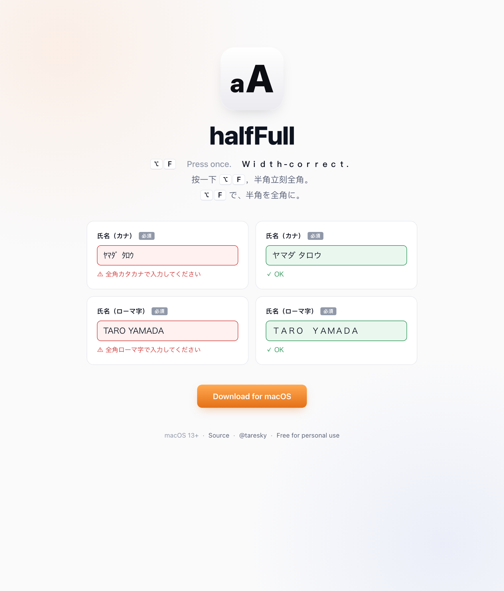

# halfFull

> macOS hotkey (<kbd>⌥</kbd><kbd>F</kbd>) for Japanese forms that demand full-width input. 半角を全角に。
>
> [halffull.taresky.me](https://halffull.taresky.me)

  

## Install

1. Download [`halfFull.zip`](https://github.com/taresky/halffull/releases/latest/download/halfFull.zip) → unzip → drag `halfFull.app` to `/Applications`.
2. Launch. Grant Accessibility in *System Settings → Privacy & Security → Accessibility*.
3. Press <kbd>⌥</kbd><kbd>F</kbd> in any text field.

> First launch is blocked by macOS Gatekeeper (ad-hoc signed). Either run `xattr -d com.apple.quarantine /Applications/halfFull.app` once in Terminal, or use the *System Settings → Privacy & Security → Open Anyway* path. Details in the [release notes](https://github.com/taresky/halffull/releases/latest).

## License

The halfFull **application** is licensed under [PolyForm Noncommercial 1.0.0](https://polyformproject.org/licenses/noncommercial/1.0.0/) — free for personal, educational, and noncommercial use.

The landing page (`docs/`) is separately released into the [public domain (CC0)](docs/LICENSE.md) — copy, fork, remix freely.

---

<b>中文</b>

macOS 快捷键（<kbd>⌥</kbd><kbd>F</kbd>），为强制要求全角输入的日本网站表单设计。

### 安装

1. 下载 [`halfFull.zip`](https://github.com/taresky/halffull/releases/latest/download/halfFull.zip)，解压，把 `halfFull.app` 拖到 `/Applications`。
2. 启动。在「系统设置 → 隐私与安全 → 辅助功能」里授权。
3. 在任意输入框按 <kbd>⌥</kbd><kbd>F</kbd>。

> 首次启动会被 macOS Gatekeeper 拦截（ad-hoc 签名）。在终端跑一次 `xattr -d com.apple.quarantine /Applications/halfFull.app`，或走「系统设置 → 隐私与安全 → 仍要打开」流程。详见 [release notes](https://github.com/taresky/halffull/releases/latest)。

### 许可

[PolyForm Noncommercial 1.0.0](https://polyformproject.org/licenses/noncommercial/1.0.0/) ——个人、教育、非商业用途免费。

<b>日本語</b>

全角入力を強制する日本のフォーム向け、macOS ホットキー（<kbd>⌥</kbd><kbd>F</kbd>）。

### インストール

1. [`halfFull.zip`](https://github.com/taresky/halffull/releases/latest/download/halfFull.zip) をダウンロード、解凍して `halfFull.app` を `/Applications` にドラッグ。
2. 起動して「システム設定 → プライバシーとセキュリティ → アクセシビリティ」で許可。
3. テキストフィールドで <kbd>⌥</kbd><kbd>F</kbd> を押すだけ。

> 初回起動は macOS Gatekeeper にブロックされます（ad-hoc 署名のため）。ターミナルで `xattr -d com.apple.quarantine /Applications/halfFull.app` を一度実行するか、「システム設定 → プライバシーとセキュリティ → このまま開く」から開いてください。詳細は [release notes](https://github.com/taresky/halffull/releases/latest) を参照。

### ライセンス

[PolyForm Noncommercial 1.0.0](https://polyformproject.org/licenses/noncommercial/1.0.0/) — 個人・教育・非商用に限り無料。

