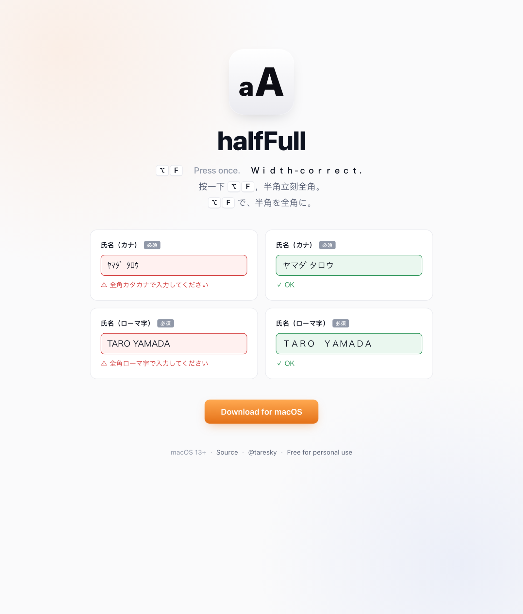

# halfFull

> Two tiny macOS text tools behind global hotkeys: switch focused text width with
> <kbd>⌥</kbd><kbd>F</kbd>, or strip clipboard formatting with
> <kbd>⌥</kbd><kbd>A</kbd>.
>
> 「全角カタカナで入力してください」「全角ローマ字で入力してください」で困ったときに。
>
> [halffull.taresky.me](https://halffull.taresky.me)

  

## Install

1. Download [`halfFull.zip`](https://github.com/taresky/halffull/releases/latest/download/halfFull.zip) → unzip → drag `halfFull.app` to `/Applications`.
2. Launch. Grant Accessibility in *System Settings → Privacy & Security → Accessibility*.
3. Press <kbd>⌥</kbd><kbd>F</kbd> in any text field, or copy rich text and press
   <kbd>⌥</kbd><kbd>A</kbd> before pasting.

## Clipboard cleaning

The clipboard target always replaces each textual pasteboard item with plain
text while preserving item boundaries. In Settings, choose **Clipboard** to
change its hotkey or enable any combination of:

- per-line leading/trailing whitespace removal, whole-text trimming;
- invisible-character, line-break, or blank-line removal;
- smart-quote replacement, consecutive-space collapsing, and tab replacement;
- safe ASCII transliteration (unsupported scripts are preserved) and Unicode NFC normalization;
- automatic paste after cleaning (off by default).

No clipboard monitoring or history is used. For legacy automation, run the app
executable with `--plain-clip` or Plain Clip-compatible flags:
`-w -l -m -i -r -b -s -p -a -q -n -v`.

> First launch is blocked by macOS Gatekeeper (ad-hoc signed). Either run `xattr -d com.apple.quarantine /Applications/halfFull.app` once in Terminal, or use the *System Settings → Privacy & Security → Open Anyway* path. Details in the [release notes](https://github.com/taresky/halffull/releases/latest).

## License

The halfFull **application** is licensed under [PolyForm Noncommercial 1.0.0](https://polyformproject.org/licenses/noncommercial/1.0.0/) — free for personal, educational, and noncommercial use.

The landing page (`docs/`) is separately released into the [public domain (CC0)](docs/LICENSE.md) — copy, fork, remix freely.

---

<b>中文</b>

两个由全局快捷键驱动的 macOS 文本工具：按 <kbd>⌥</kbd><kbd>F</kbd>
转换聚焦文本的全角/半角形态；按 <kbd>⌥</kbd><kbd>A</kbd> 清除剪贴板格式。

### 安装

1. 下载 [`halfFull.zip`](https://github.com/taresky/halffull/releases/latest/download/halfFull.zip)，解压，把 `halfFull.app` 拖到 `/Applications`。
2. 启动。在「系统设置 → 隐私与安全 → 辅助功能」里授权。
3. 在任意输入框按 <kbd>⌥</kbd><kbd>F</kbd>；或复制富文本后按
   <kbd>⌥</kbd><kbd>A</kbd>，再粘贴纯文本。

在设置中选择「剪贴板」，可以修改快捷键，并配置行首/行尾空白、不可见字符、
换行和空白行、智能引号、连续空格、制表符、安全 ASCII 转写（保留中文等其他文字）、
Unicode NFC，以及清理后自动粘贴。
应用不会监控剪贴板，也不会保存剪贴板历史。

> 首次启动会被 macOS Gatekeeper 拦截（ad-hoc 签名）。在终端跑一次 `xattr -d com.apple.quarantine /Applications/halfFull.app`，或走「系统设置 → 隐私与安全 → 仍要打开」流程。详见 [release notes](https://github.com/taresky/halffull/releases/latest)。

### 许可

[PolyForm Noncommercial 1.0.0](https://polyformproject.org/licenses/noncommercial/1.0.0/) ——个人、教育、非商业用途免费。

<b>日本語</b>

2つのグローバルホットキーを備えた macOS テキストツールです。
<kbd>⌥</kbd><kbd>F</kbd> でフォーカス中のテキストの半角・全角を変換し、
<kbd>⌥</kbd><kbd>A</kbd> でクリップボードの書式を除去します。

### インストール

1. [`halfFull.zip`](https://github.com/taresky/halffull/releases/latest/download/halfFull.zip) をダウンロード、解凍して `halfFull.app` を `/Applications` にドラッグ。
2. 起動して「システム設定 → プライバシーとセキュリティ → アクセシビリティ」で許可。
3. テキストフィールドで <kbd>⌥</kbd><kbd>F</kbd>、またはリッチテキストを
   コピーした後に <kbd>⌥</kbd><kbd>A</kbd> を押します。

設定の「Clipboard」では、空白・不可視文字・改行・引用符・安全な ASCII 変換・Unicode NFC
などのクリーニングと、クリーニング後の自動ペーストを設定できます。
クリップボードの監視や履歴保存は行いません。

> 初回起動は macOS Gatekeeper にブロックされます（ad-hoc 署名のため）。ターミナルで `xattr -d com.apple.quarantine /Applications/halfFull.app` を一度実行するか、「システム設定 → プライバシーとセキュリティ → このまま開く」から開いてください。詳細は [release notes](https://github.com/taresky/halffull/releases/latest) を参照。

### ライセンス

[PolyForm Noncommercial 1.0.0](https://polyformproject.org/licenses/noncommercial/1.0.0/) — 個人・教育・非商用に限り無料。

